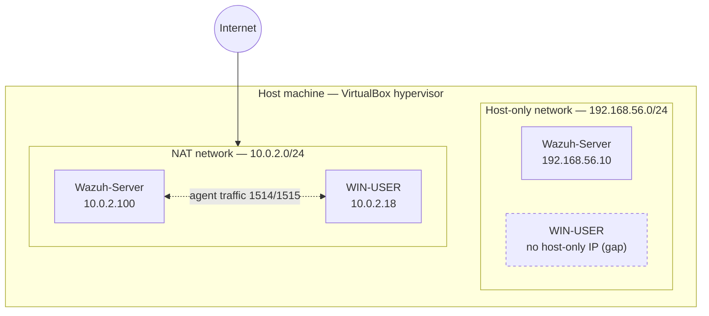

# Lab Network Architecture

**Hypervisor:** VirtualBox
**Host machine:** Physical workstation running VirtualBox with two virtual networks attached to the lab VMs.

---

## Diagram

---

## Network Summary

| Network | CIDR | Purpose |
|---|---|---|
| **NAT Network** (`NatNetwork`) | `10.0.2.0/24` | Shared internal network with outbound internet access. Carries all Wazuh agent ↔ manager traffic (ports 1514/1515) since both VMs sit on this subnet. |
| **Host-only Adapter** | `192.168.56.0/24` | Lets the physical host reach VMs directly — used to browse the Wazuh dashboard (443) and API (55000) without exposing the manager to the NAT network or internet. |

## Hosts

| Host | NAT Network IP | Host-only IP | Role |
|---|---|---|---|
| **Wazuh-Server** | `10.0.2.100` | `192.168.56.10` | Wazuh manager, dashboard, API |
| **WIN-USER** | `10.0.2.18` | — *(not assigned)* | Monitored endpoint running Sysmon + Wazuh agent |
