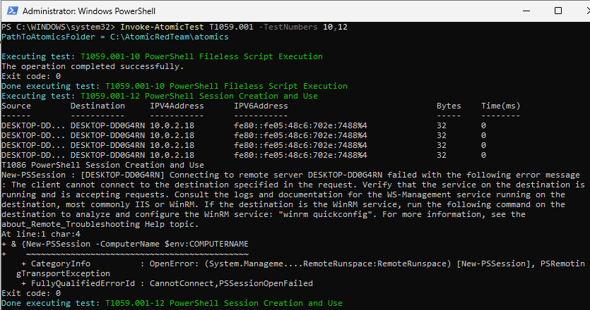
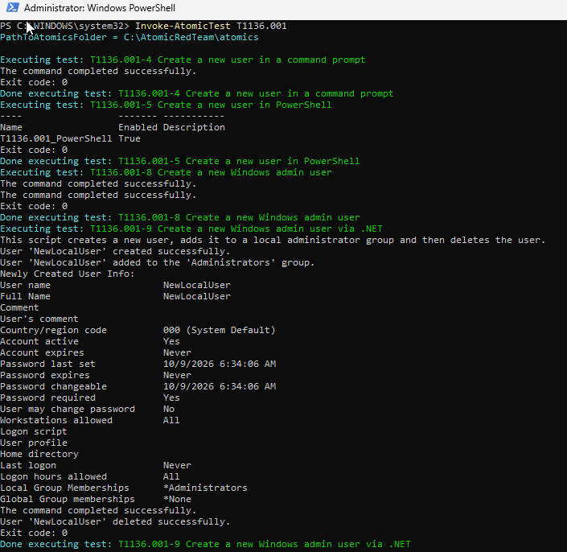

# Atomic Red Team Execution Report

**Environment:** Windows Lab (Host: `DESKTOP-DD64RN`)
**Atomics Path:** `C:\AtomicRedTeam\atomics`
**Executed By:** Administrator

---

## 🎯 Execution 1: T1059.001 - PowerShell

**Command Run:** `Invoke-AtomicTest T1059.001 -TestNumbers 10,12`

### Test 10: PowerShell Fileless Script Execution
- **Status:** ✅ Success
- **Exit Code:** 0
- **Observation:** The test executed successfully. This technique is typically used to bypass traditional disk-based antivirus detection.

## Screenshot: Execution



### Test 12: PowerShell Session Creation and Use
- **Status:** ⚠️ Environment Limit Reached (Test executed, but command failed)
- **Exit Code:** 0
- **Error Observed:**

```text
New-PSSession : [DESKTOP-DD64RN] Connecting to remote server DESKTOP-DD64RN failed with the following error
message: The client cannot connect to the destination specified in the request. Verify that the service on
the destination is running and is accepting requests. Consult the logs and documentation for the
WS-Management service running on the destination, most commonly IIS or WinRM. If the destination is the
WinRM service, run the following command on the destination to analyze and configure the WinRM service:
"winrm quickconfig".
```

**Analysis:** The atomic test attempted to establish a PowerShell Remoting session (`New-PSSession`). The failure occurred because WinRM is not configured or running on the local machine to accept remote connections. The atomic framework logged this as `Exit code: 0` because the test script itself completed its run, even though the underlying PowerShell command failed.

---

## 🎯 Execution 2: T1136.001 - Create Account: Local Account

**Command Run:** `Invoke-AtomicTest T1136.001` (Ran all applicable tests)

### Test 4: Create a new user in a command prompt
- **Status:** ✅ Success
- **Exit Code:** 0
- **Details:** Used the traditional `net user` command-line utility to create a local account.

### Test 5: Create a new user in PowerShell
- **Status:** ✅ Success
- **Exit Code:** 0
- **Details:** Used PowerShell cmdlets (likely `New-LocalUser`) to create a local account.
- **Artifacts Observed:** Created user `T1136.001_PowerShell`.

### Test 8: Create a new Windows admin user
- **Status:** ✅ Success
- **Exit Code:** 0
- **Details:** Created a local user and added them to the local Administrators group.

### Test 9: Create a new Windows admin user via .NET
- **Status:** ✅ Success (with automated cleanup)
- **Exit Code:** 0
- **Details:** Leveraged the .NET `System.DirectoryServices` namespace to create a user.
- **Log Output:**
  - `User NewLocalUser created successfully.`
  - `User NewLocalUser added to the Administrators group.`
  - `User NewLocalUser deleted successfully.`
- **Analysis:** This test natively includes a cleanup function that removes the user it creates.

## Screenshot: Execution



---

## 📝 Lab Observations & Next Steps

- **Event Log Monitoring:** For the T1136.001 tests, check your Windows Security Event Logs. Look specifically for Event ID 4720 (*A user account was created*) and Event ID 4732 (*A member was added to a security-enabled local group*).
- **WinRM Configuration:** If you want Test 12 (T1059.001) to fully succeed, run `winrm quickconfig` in an elevated PowerShell prompt on your lab machine. Leaving it disabled is also fine if your goal is to test detection rules for failed lateral movement attempts.
- **Cleanup:** While Test 9 cleaned up after itself, Tests 4, 5, and 8 may have left local user accounts behind. Run the cleanup command for T1136.001 to reset your lab environment:

```powershell
Invoke-AtomicTest T1136.001 -Cleanup
```

## 💡 Recommendation for Future Executions

To make reviewing your lab work easier, save results to a CSV file on your next run:

```powershell
Invoke-AtomicTest T1136.001 -ExecutionLogPath "C:\AtomicRedTeam\Reports\T1136.001_ExecutionLog.csv"
```

This gives a clean, spreadsheet-formatted record of which tests passed, failed, or encountered environment errors.

---

## 🔍 Quick Analysis of This Run

- **T1059.001 Test 12:** The WinRM error isn't a problem — it's a good detection opportunity. Your EDR/SIEM should alert on a PowerShell process attempting a network connection or remote session, even if it failed.
- **T1136.001:** Multiple local users and an admin user were created successfully — exactly what a red teamer does to establish persistence. Make sure to clean up the leftover accounts from Tests 4, 5, and 8 so they don't interfere with future tests.