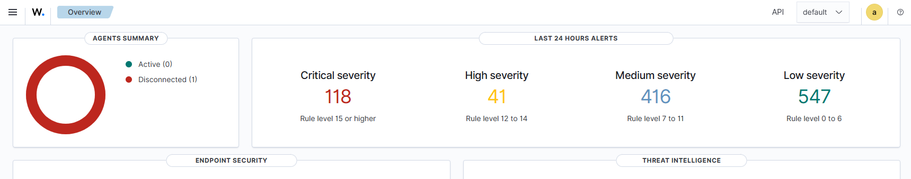
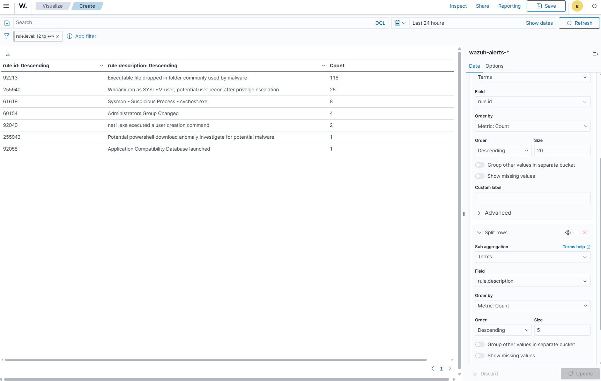
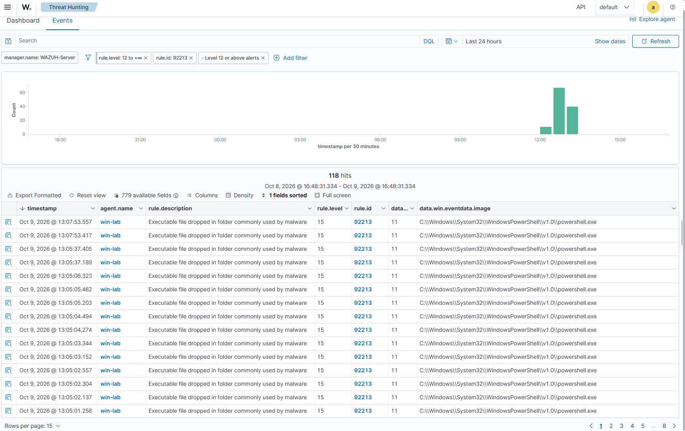

# Wazuh SOC Alert Triage: Critical Alert Investigation

## 1. Overview: High Alert Volume

The Wazuh dashboard shows a high volume of alerts across multiple severity levels, as shown in the screenshot below.

| Severity | Alert Count |
|---|---:|
| Critical | 118 |
| High | 41 |
| Medium | 416 |
| Low | 547 |
| **Total** | **1,122** |

**Screenshot: Wazuh Alert Overview**



The volume of alerts makes manual, one-by-one investigation inefficient. The initial goal is to identify which detection rules generate the most critical alerts, then investigate representative events and correlate them with related Windows Sysmon events.

---

## 2. Prioritize Critical Alerts in Bulk

### Step 1 — Filter High-Severity Alerts

In the Wazuh Dashboard, open **Discover** and apply a severity filter for the investigation time window.

```text
rule.id >= 12
```

This narrows the investigation to alerts with a rule level of 12 or higher. Confirm the severity ranges used by your Wazuh rules before treating this as the complete critical-alert population — level thresholds can be customized per deployment.

**Screenshot: Visualize Filter of rule.level 12**


### Step 2 — Group Alerts by Rule ID

Instead of opening all 118 critical alerts individually, use a data table visualization to identify which rules generate the most alerts.

In **Visualize → Data Table** (menu naming may vary by dashboard version):

1. Add a **Terms** bucket aggregation.
2. Select `rule.id` as the field.
3. Set the metric to **Count**.
4. Sort by Count, descending.
5. Set the size to 10–20.
6. Apply and inspect the results.

This groups alerts by detection rule and highlights the rules contributing the most volume.

### Step 3 — Review Rule Descriptions

To understand what each rule detects:

1. Add `rule.description` as a second column or bucket.
2. If it isn't aggregatable, check whether `rule.description.keyword` exists in the index mapping.
3. Apply and review.

**SCREENSHOT PLACEHOLDER — rule.description column added**


**Expected outcome:** A ranked list of detection rules, making it easier to spot repeated alerts and focus investigation effort on the most significant patterns.

**SCREENSHOT PLACEHOLDER — rule.id data table**



> **Note:** Aggregation helps prioritize *where* to look — it does not by itself establish whether an alert is benign or malicious. A rule producing many alerts may reflect normal activity, a test run, or a genuine incident.

---

## 3. Investigate a Critical Alert Through Sysmon Correlation

After identifying a high-volume or high-severity rule, open a representative alert and examine its event fields. This investigation focused on the process GUID and related Sysmon events to reconstruct process activity.

### Step 1 — Identify the Process GUID

The initial alert was associated with a PowerShell process. Record its `processGuid` and use it to search for related events — a process GUID uniquely identifies a specific process instance and can correlate events across Sysmon Event IDs.

> **[SCREENSHOT PLACEHOLDER — Alert detail / processGuid]**
> Capture: the expanded raw alert document showing `data.win.eventdata.processGuid`, `data.win.eventdata.image`, and `data.win.eventdata.commandLine` fields.
> ``

### Step 2 — Correlate Sysmon Event IDs 1, 7, and 11

| Sysmon Event ID | Event Type | Investigation Purpose |
|---|---|---|
| 1 | Process Create | Command line, process ID, parent process, process GUID |
| 7 | Image Load | Which executable images or DLLs were loaded |
| 11 | File Create | Files created by the process |

The FileCreate event involved a temporary PowerShell script with a filename resembling:

```text
__PSScriptPolicyTest_*.ps1
```

This pattern is associated with PowerShell execution-policy checks and should **not** be classified as malicious based on filename alone.

The ImageLoad event involved `System.Management.Automation`, a core PowerShell component. Although the triggering alert referenced a possible DLL side-loading technique, the presence of this component alone does not establish side-loading — it loads on virtually all normal PowerShell execution.

> **[SCREENSHOT PLACEHOLDER — Correlated Sysmon events 1/7/11]**
> Capture: Discover results filtered to the same `processGuid`, showing the Event ID 1 (ProcessCreate), 7 (ImageLoad), and 11 (FileCreate) rows for this process, with timestamps visible.
> ``

### Step 3 — Trace the Parent Process

Inspect the ProcessCreate event to identify the parent process:

- `processGuid` — identifies the process performing the observed action
- `parentProcessGuid` — identifies the process that launched it
- `commandLine` — the command used to start the process

Search by GUID in Discover:

```text
data.win.eventdata.processGuid:"{4bbc6e47-6cd2-6ac8-b402-000000000700}"
```

**Important:** A GUID search can return multiple events for the same process, but does not by itself prove every nearby command belongs to the same execution chain. Correlate process GUIDs, parent GUIDs, timestamps, and command lines together before drawing conclusions.

> **[SCREENSHOT PLACEHOLDER — Parent process GUID search]**
> Capture: Discover results for the `parentProcessGuid` query, showing the parent process's `image` and `commandLine` fields.
> ``

---
## 4. Key Findings

1. **High alert volume:** The dashboard showed 1,122 alerts across critical, high, medium, and low severity. Grouping by rule ID is a far more efficient starting point than opening every alert individually.
2. **Process correlation:** Sysmon Event IDs 1, 7, and 11 provided process-creation, image-load, and file-creation telemetry associated with the PowerShell activity.
3. **PowerShell investigation:** The temporary script filename and PowerShell component load both require contextual validation — neither is sufficient evidence of malware on its own.
4. **Atomic Red Team activity:** The reported T1059.001 and T1136.001 test executions offer a plausible explanation for related PowerShell and local-account activity, provided host identity and timestamps match.
5. **Account security:** The local-account and administrator-group tests should be validated against Windows Security events and checked for successful cleanup.
6. **Detection validation:** The investigation should establish whether Wazuh captured the expected events, correlated them correctly, and generated useful alerts.

---

## 8. Conclusion

This investigation demonstrates a practical SOC triage workflow: prioritize high-severity alerts, identify noisy detection rules, correlate related Sysmon events, trace process ancestry, and compare observed activity against known lab executions.

The preliminary assessment is that some of the observed activity is consistent with the Atomic Red Team tests reported as executed. Before closing the investigation as benign: confirm host identity and timestamps match, validate account cleanup, and review any unexplained activity outside the expected test sequence.